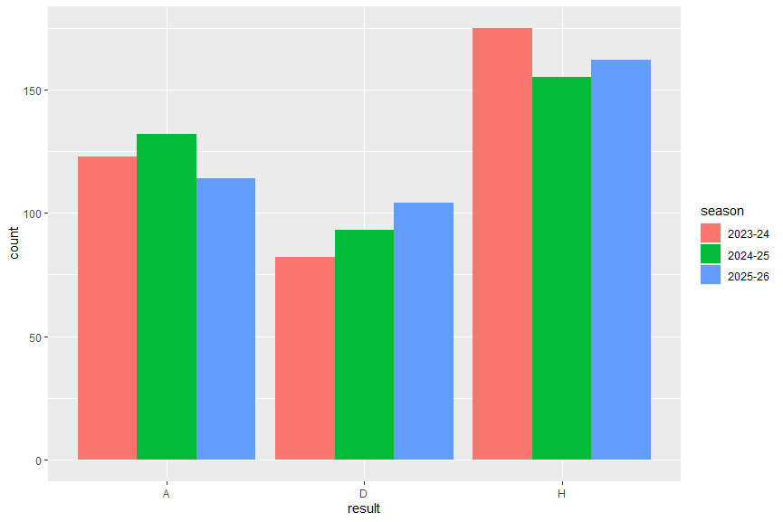

# Premier League Home-Field Advantage

An analysis in R of whether home teams have a measurable advantage in the English Premier League.

## Question
Do Premier League home teams perform better than away teams, and is the difference statistically significant?

## Data
1,140 matches from the 2023-24, 2024-25, and 2025-26 seasons (380 per season). Match data comes from [https://www.football-data.co.uk](https://football-data.co.uk/englandm.php)
## Method
- Loaded and combined three seasons of match results in R using `tidyverse`
- Calculated result percentages and average goals
- Compared home and away goals per match with a paired t-test
- Visualized results by season with `ggplot2`

## Results

| Measure | Home | Away |
|---|---|---|
| Win % | 43.2% | 32.4% |
| Average goals per match | 1.61 | 1.37 |

Draws were 24.5% of matches.

A paired t-test on goals per match gave a mean difference of 0.24 goals (t = 4.33, p < 0.001).

## Conclusion
Home teams won about 11 percentage points more matches than away teams and scored about a quarter of a goal more per match. The difference is statistically significant, but modest in size.

## Files
- `premier_league_home_field_analysis.R`: the full analysis script
- `Prem23-24.csv`, `Prem24-25.csv`, `Prem25-26.csv`: match data

## How to run
Download the files into one folder, open `premier_league_home_field_analysis.R` in RStudio, install `tidyverse` if needed, and run the script.
